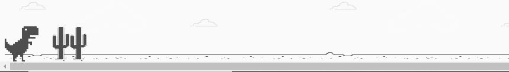

# Dino-Bootcamp

<h4>Informações do Projeto</h4>
  

Neste projeto fiz o desafio de criar uma cópia do jogo do dinossauro, famoso no Chrome por nos entreter quando estamos sem conexão. Nele utilizei HTML, CSS e JavaScript, abordando de maneira simples diversos conceitos introdutórios importantes para programação na web como tags básicas de HTML, manipulação de eventos, funções e manipulação de elementos HTML usando JavaScript, estilização e animações básicas com CSS.
  
  

  
  <h1> Screenshots </h1>
  
  <h2> Game </h2>
  
  
  
  <h2> Game - Over </h2>
  
   
